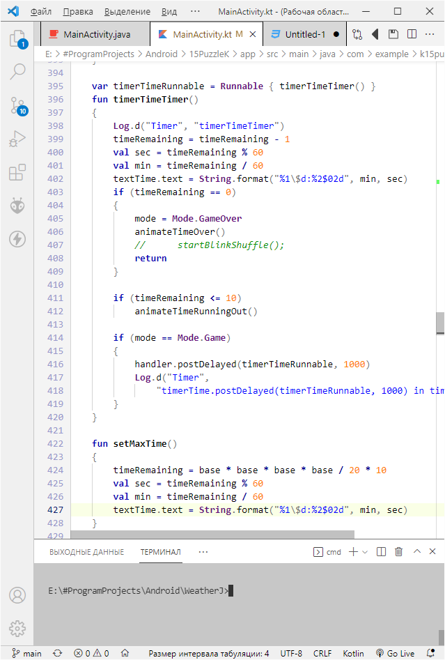

# skivvy themes

Содержит две темы:

* skivvy Delphi - похожа на тему по умолчанию в Delphi:

* skivvy colorful - более яркая раскраска ключевых слов, больше подходит для других языков, например JavaScript.

Также в этих темах добавлены разделительные полосы (borders) в элементах управления vscode.

Создано на основе темы [Delphi Themes](https://marketplace.visualstudio.com/items?itemName=alefragnani.delphi-themes) от Alessandro Fragnani.

**Enjoy!**
